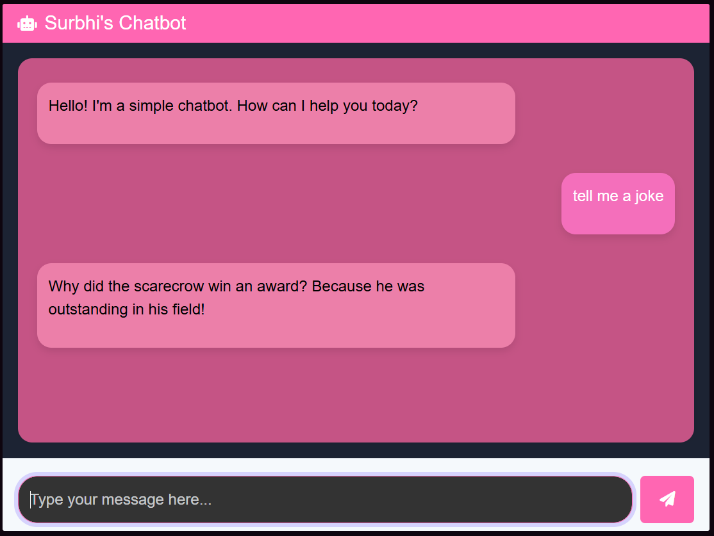
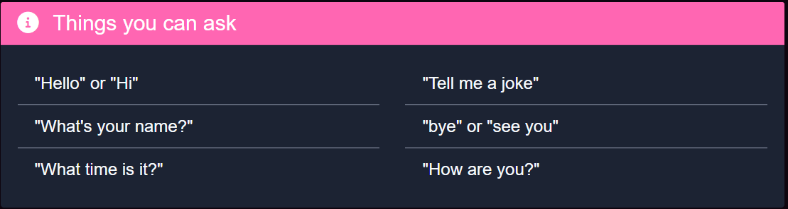

# Simple Python Chatbot 
A simple chatbot built using Python and Flask that can respond to user queries, tell the current time, and perform basic math operations. It features an interactive chat interface created with HTML, CSS, and JavaScript.




## Features:
- Responds to greetings like "Hi" and "Hello"
- Provides the current time when asked
- Displays jokes for a fun interaction
- Interactive chat UI built with Bootstrap and custom CSS


## Requirements:
- Python 3.x
- Flask

## Installation:
1. Clone the repository:
   ```bash
python app.py

